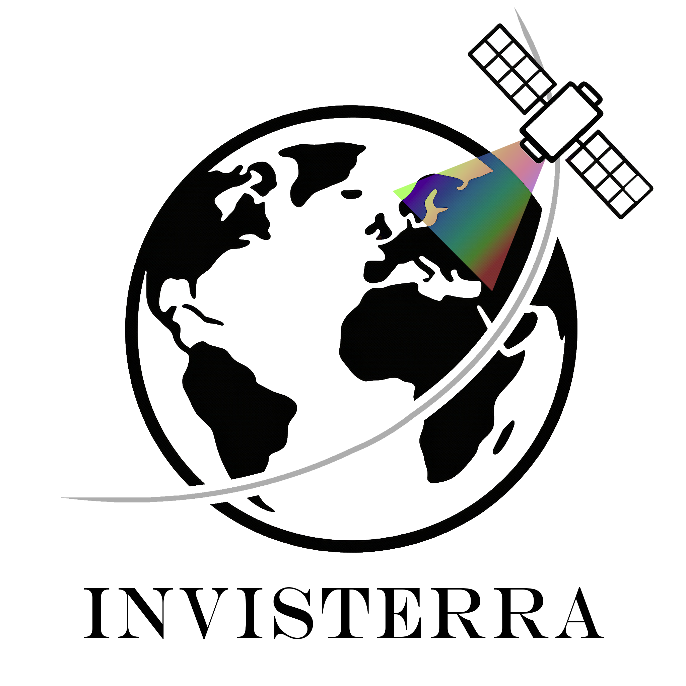

<p align="center">
  
</p>
<h1 align="center">INVISTERRA - Toolkit for Multispectral Land Analysis</h1>

InvisTerra is an educational toolkit for **satellite imagery analysis** and **spectral index mapping** based on Sentinel‑2 data, built with **Streamlit** and modern Python geospatial libraries.
The application enables experimenting with raster/vector loading, spectral index computation, zonal statistics and professional cartographic visualizations.

> **⚠️ Disclaimer**
> InvisTerra is intended **for educational and research purposes only**.
> It **must not** be used as an operational tool for critical decision‑making (e.g. disaster response, legal land assessment, or commercial services).

---

## 🎯 Features

- **Spectral index computation**
  - NDVI, NDWI, NDBI, NBR, EVI, SAVI and other common indices.
  - Flexible handling of Sentinel‑2 bands (automatic band detection from filenames).
  - Clipping and normalization of index values for cleaner outputs.

- **Streamlit web UI**
  - Clear tabbed interface:
    - **HOME** – landing page and basic documentation.
    - **INDEKSY** – explanations and formulas of spectral indices.
    - **MAPS** – main analysis environment.
  - Sidebar workflow for:
    - Uploading raster bands (GeoTIFF).
    - Uploading optional vector data (GeoJSON) for zonal statistics.
    - Choosing spectral index, color maps, and map settings.
  - Built‑in dark/light theme support via custom CSS.

- **Professional map composition**
  - Full‑frame map rendering with:
    - Custom map title.
    - North arrow in the top‑right corner.
    - Combined legend and scale bar in the bottom‑left corner.
    - Metadata box (source, CRS, resolution) in the bottom‑right corner.
  - High‑resolution PNG export (e.g. 300 DPI) suitable for reports and publications.

- **Zonal statistics**
  - Support for GeoJSON vector layers.
  - Computation of per‑polygon statistics (mean, min, max, std, count).
  - Results preview in a table and export to CSV.

- **Interactive web map**
  - Folium‑based map with multiple base layers (OSM, terrain, satellite, etc.).
  - Bounding box overlay and center marker for the processed raster.
  - Ready for integration with additional layers (e.g. shapefiles converted to GeoJSON).

- **Modular architecture**
  - Clear separation of:
    - `Pages/` – logical sections (HOME, INDEKSY, MAPS).
    - `Pages/Themes/` – theming and styling helpers.
    - Raster/vector processing and visualization utilities.
  - Easy to extend with new indices, layouts, or analysis modules.

---

## 📁 Project Structure

```text
InvisTerra/
├── Dockerfile                  # Docker build recipe for the app
├── docker-compose.yml          # Optional Docker Compose orchestration
├── main.py                     # Streamlit entry point
├── requirements.txt            # Python dependencies
├── README.md                   # Project documentation
│
├── Pages/
│   ├── home.py                 # HOME tab – landing page and info
│   ├── indeksy.py              # INDEKSY tab – spectral index descriptions
│   ├── maps.py                 # MAPS tab – main analysis & visualization
│   │
│   └── Themes/
│       ├── light_theme.py      # Light theme definition
│       ├── dark_theme.py       # Dark theme definition
│       └── apply_theme.py      # Theme application helpers
│
└── assets/
    ├── icons/                  # Optional icons, logos
    └── samples/                # Example rasters/vectors (if provided)
```

---

## 🛠️ Technology Stack

- **Language & runtime**
  - Python 3.10+ (recommended)

- **Web UI**
  - [Streamlit](https://streamlit.io/) – fast web apps for data science

- **Raster & vector processing**
  - `rasterio` – reading/writing GeoTIFF rasters
  - `numpy` – numerical operations and index calculations
  - `geopandas` – vector data handling
  - `rasterstats` – zonal statistics

- **Mapping & visualization**
  - `matplotlib` – static map rendering with legends, north arrow, scale bar
  - `folium` – interactive web maps
  - `streamlit-folium` – embedding Folium maps in Streamlit

- **Packaging / deployment**
  - `Docker` – containerized environment for reproducible runs

---

## 🚀 Installation

### 1. Clone the repository

```bash
git clone https://github.com/<your-username>/InvisTerra.git
cd InvisTerra
```

### 2. Create and activate virtual environment (recommended)

```bash
python -m venv .venv

# Windows
.venv\Scripts\activate

# Linux / macOS
source .venv/bin/activate
```

### 3. Install dependencies

```bash
pip install --upgrade pip
pip install -r requirements.txt
```

---

## ▶️ Running the Application (Local Python)

From the project root:

```bash
streamlit run main.py
```

Then open in your browser:

```text
http://localhost:8501
```

---

## 🐳 Running with Docker

### 1. Build image directly from GitHub

```bash
docker build -t invisterra-app https://github.com/vGiacomov/InvisTerra.git
```

### 2. Run the container

```bash
docker run -d -p 8501:8501 --name invisterra-app invisterra-app
```

Now open:

```text
http://localhost:8501
```

### 3. Using Docker Compose (optional)

`docker-compose.yml` example:

```yaml
services:
  invisterra-app:
    image: invisterra-app:latest
    container_name: invisterra-app
    ports:
      - "8501:8501"
    restart: unless-stopped
    volumes:
      - ./data:/app/data
      - ./uploads:/app/uploads
```

Run:

```bash
docker-compose up -d
```

Stop:

```bash
docker-compose down
```

---

## 📦 Outputs

InvisTerra can export:

- **GeoTIFF** – computed spectral index in georeferenced raster format.
- **PNG (high‑resolution)** – full map layout for use in reports or theses.
- **Text/CSV reports**:
  - Global statistics for the index.
  - Zonal statistics per polygon (when vector data provided).

---

## 🤝 Contributing

Contributions are welcome. Possible areas:

- Adding new spectral indices.
- Improving map aesthetics and export options.
- Supporting additional sensors (e.g. Landsat).
- Extending interactive map functionality.
- Enhancing documentation and tutorials.

---

## 📄 License

This project is provided solely for educational and research purposes.
Any commercial use, distribution, or monetization is not permitted.

---

